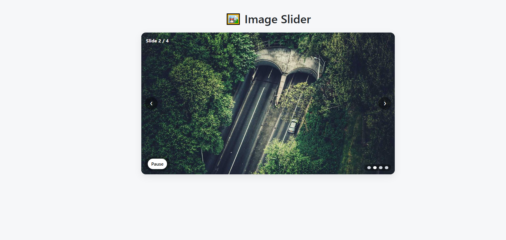

# 🖼️ Image Slider

Un slider d’images interactif (carrousel) construit avec HTML, CSS et jQuery.
Il prend en charge : lecture automatique **(autoplay)**, **navigation manuelle**, **bouton Pause/Lecture**, et **indicateurs cliquables**.

---

## 📋 Présentation

**Image Slider** est conçu pour :

- Afficher automatiquement une série d’images avec des transitions fluides.

- Permettre la navigation manuelle grâce aux boutons Précédent / Suivant.

- Mettre en pause ou reprendre le défilement avec un bouton Lecture/Pause.

- Accéder directement à une image via les points (indicateurs) cliquables.

- Suspendre l’autoplay lors du survol du slider (et reprendre en quittant).

---

## 🚀 Fonctionnalités

✅ Lecture automatique avec intervalle configurable
✅ Boutons Précédent / Suivant
✅ Bouton Lecture / Pause
✅ Points indicateurs pour navigation directe
✅ Design moderne et responsive
✅ Pause automatique au survol

---

## 🛠️ Technologies utilisées

- 🌐 HTML5 – Structure du slider

- 🎨 CSS3 – Mise en forme, transitions, disposition

- ⚙️ JavaScript (jQuery) – Logique et interactivité

---

## 🔢 Exemple

- **Intervalle d’autoplay** : 3 secondes

- **Slides** : 3 images de démonstration issues de[Picsum Photos](https://picsum.photos)

---

## 📸 Aperçu (concept UI)



## 📁 Structure du projet

```
image-slider/
├── index.html # Main HTML structure
├── style.css # (Optional) extracted CSS
├── script.js # (Optional) extracted JS
├── screenshot.png # Screenshot of the slider
├── README.md # English documentation
└── README.fr.md # French documentation

```

## 📖 Explication du code

### **1. Structure HTML (index.html)**

- **Conteneur principal**

```html
<div id="slider">...</div>
```

C’est l’enveloppe principale du slider..

- **Slides**

```html
<div class="slide active"></div>
```

Chaque div .slide contient une image.
La classe active indique l’image actuellement affichée.

- **Buttons**

```html
<button id="prevBtn">❮</button>
<button id="nextBtn">❯</button>
<button id="playPauseBtn">Pause</button>
```

prevBtn → image précédente

nextBtn → image suivante

playPauseBtn → bascule lecture/pause

- **Dots (Indicators)**

```html
<span class="dot" data-index="0"></span>
```

Chaque dot possède un attribut data-index qui correspond à une slide.
Le point actif reflète l’image visible.

### **2. CSS Styles**

.slide → masqué par défaut (opacity: 0)

.slide.active → affiché (opacity: 1)

.btn → boutons de navigation positionnés en absolu sur le slider

.dot → indicateurs circulaires ; le dot actif est coloré en blanc

### **3. JavaScript (jQuery)**

Variables principales
currentIndex, intervalId, intervalMs

Fonction showSlide(index)
Affiche l’image correspondant à l’index passé en paramètre.

Autoplay (setInterval)
Défile automatiquement toutes les 3 secondes.

Boutons Précédent / Suivant
Permettent une navigation manuelle.

Bouton Lecture/Pause
Bascule l’autoplay en démarrage/arrêt.

Indicateurs (.dot)
Un clic sur un dot affiche directement l’image correspondante.

Pause au survol (mouseenter)
Arrête le défilement automatique quand la souris survole le slider, et le reprend au mouseleave.

## Survol souris → pause du défilement automatique

🔗Démo en ligne
👉 [Click here to try Image Slider](https://projectsjavascript.github.io/Image-Slider/)

---

📄 Licence
Ce projet est open-source et disponible sous la licence MIT.

### 🌐 Langue / Language

- 🇫🇷 [Lire en Français](./README.fr.md)
- 🇬🇧 [Read in English](./README.md)
