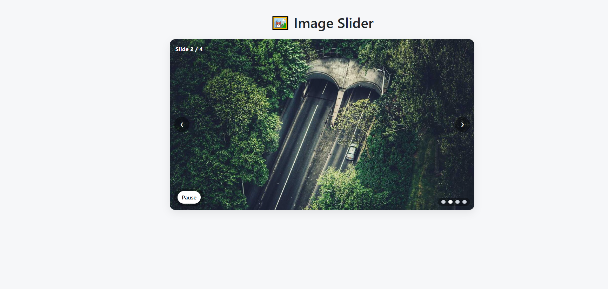

# 🖼️ Image Slider

A simple and interactive image slider (carousel) built with **HTML, CSS, and jQuery**.  
It supports **autoplay**, **manual navigation**, **pause/play toggle**, and **clickable indicators**.

---

## 📋 Overview

**Image Slider** is designed to:

- Automatically display a series of images with smooth transitions.
- Allow users to manually navigate using **Previous / Next** buttons.
- Pause or resume autoplay with a **Play/Pause** button.
- Directly jump to any image using clickable **dots (indicators)**.
- Pause autoplay when hovering the slider (resume when leaving).

---

## 🚀 Features

✅ Autoplay with configurable interval  
✅ Previous / Next buttons  
✅ Play / Pause toggle button  
✅ Dots for direct navigation  
✅ Responsive and modern design  
✅ Hover pause

---

## 🛠️ Technologies Used

- 🌐 **HTML5** – Structure of the slider
- 🎨 **CSS3** – Styling, transitions, layout
- ⚙️ **JavaScript (jQuery)** – Interactivity and logic

---

## 🔢 Example

- **Autoplay interval**: 3 seconds
- **Slides**: 3 demo images from [Picsum Photos](https://picsum.photos)

---

## 📸 Screenshot (UI Concept)



## 📁 Project Structure

```
image-slider/
├── index.html # Main HTML structure
├── style.css # (Optional) extracted CSS
├── script.js # (Optional) extracted JS
├── screenshot.png # Screenshot of the slider
├── README.md # English documentation
└── README.fr.md # French documentation

```

## 📖 Code Explanation

### **1. HTML Structure (`index.html`)**

- **Container**

```html
<div id="slider">...</div>
```

Main wrapper for the slider.

- **Slides**

```html
<div class="slide active"></div>
```

Each div.slide contains one image.
The active class defines the currently visible image.

- **Buttons**

```html
<button id="prevBtn">❮</button>
<button id="nextBtn">❯</button>
<button id="playPauseBtn">Pause</button>
```

prevBtn → Previous image

nextBtn → Next image

playPauseBtn → Toggle autoplay

- **Dots (Indicators)**

```html
<span class="dot" data-index="0"></span>
```

Each dot has a data-index attribute that maps to a slide.
The active dot matches the current image

### **2. CSS Styles**

.slide → hidden by default (opacity: 0)

.slide.active → visible (opacity: 1)

.btn → navigation buttons styled with absolute positioning

.dot → indicators styled as circles; active dot = white

### **3. JavaScript (jQuery)**

Variables → currentIndex, intervalId, intervalMs

Fonction showSlide(index) → affiche l’image souhaitée

Autoplay (setInterval) → défilement toutes les 3 secondes

Boutons → navigation manuelle

Play / Pause → bascule l’autoplay

Indicateurs → clic pour accéder directement à une image

## Survol souris → pause du défilement automatique

🔗Live Demo
👉 [Click here to try Image Slider](https://projectsjavascript.github.io/Image-Slider/)

---

📄 License
This project is open-source and available under the MIT License.

### 🌐 Langue / Language

- 🇫🇷 [Lire en Français](./README.fr.md)

- 🇬🇧 [Read in English](./README.md)
